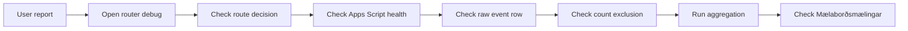

# Debug-handbook fyrir Landspítali Power BI Router Tracker

Tilgangur: hagnýt handbók til að sanna routing, tracking, counting og status behavior án þess að menga production counts.

## Golden rule

Debugging must never inflate production visits.

Notaðu debug/manual/health/list modes fyrir rannsókn. Debug/root/bot/diagnostic/manual/test/list/health rows eru ekki production visits. Aldrei „laga“ missing visits með því að telja debug eða diagnostic rows. Athuga alltaf `count_as_visit` og `count_exclusion_reason`.

## Debug URL cookbook

Root gateway:

```text
/Landspitali/?list=1
/Landspitali/?dashboards=1
/Landspitali/?health=1
/Landspitali/?status=1
/Landspitali/?debug=1
/Landspitali/?manual=1
/Landspitali/?noredirect=1
/Landspitali/?dashboard=bradamottaka
/Landspitali/?id=thjonustukannanir
```

Dashboard routes:

```text
/Landspitali/bradamottaka/?debug=1
/Landspitali/bradamottaka/?manual=1
/Landspitali/bradamottaka/?noredirect=1
/Landspitali/bradamottaka/?force=mobile
/Landspitali/bradamottaka/?force=desktop
/Landspitali/bradamottaka/?view=mobile
/Landspitali/bradamottaka/?view=desktop
/Landspitali/bradamottaka/?debug=1&manual=1
```

Endurtaka með `/Landspitali/thjonustukannanir/`.

## Router debug panel

Source `renderDebug` sýnir: mælaborð, valda útgáfu, sjálfvirka útgáfu, route reason detail, device class, skjábreidd, browser brand/engine, OS, language, timezone, color scheme/forced colors, forced dark, Samsung dark mode status, theme signal quality, source category, config version/source, router core og manual links fyrir mobile/desktop/selected URL.

## Health mode

`?health=1` eða `?status=1` renderar router health: status ok, config version, config source, core version, tracking enabled/disabled, dashboard og path. Það telur ekki sem visit.

## List/directory mode

`?list=1` eða `?dashboards=1` renderar registered dashboards. `trackDirectoryViews` er `false` í config, þannig að list views eru ekki tracked nema config breytist.

## Manual/no-redirect mode

`?manual=1` eða `?noredirect=1` stoppar redirect og birtir manual links. Þetta er gagnlegt á mobile til að skoða route decision og opna mobile/desktop beint. Telst ekki visit.

## Force mode

`?force=mobile`, `?force=desktop`, `?view=mobile`, `?view=desktop` aðskilja router issue frá Power BI report layout issue. Í normal redirect geta þau talist visits ef Talningarhlið stenst.

## Apps Script endpoint debug

Nota placeholder nema endpoint sé þegar vísvitandi birt í source:

```text
<APPS_SCRIPT_EXEC_URL>?api=health
<APPS_SCRIPT_EXEC_URL>?api=status
<APPS_SCRIPT_EXEC_URL>?api=dashboard
<APPS_SCRIPT_EXEC_URL>?api=dashboard&format=js&callback=LandspitaliRouterStatusData
<APPS_SCRIPT_EXEC_URL>?api=registry
<APPS_SCRIPT_EXEC_URL>?api=registry&format=jsonp&callback=LandspitaliRouterRegistry
```

Expected fields: `ok`, `script_version`, `schema_version`, `config_version`, `health`, raw rows, last raw/count/diagnostic/error event time, last aggregation time, dashboard data generated time, warnings og registry/public cards.

## Google Sheets workbook debug

Skoða: `Events_Raw`, `Errors`, `Aggregates_Daily`, `Aggregates_Hourly`, `Aggregates_Dashboard`, `Aggregates_Device`, `Aggregates_Source`, `Aggregates_Route`, `Aggregates_Quality`, `Dashboard_Registry`, `Public_Page_Registry`, `Data_Dictionary`, `Control`, `Archive_Log`, `Dashboard_Data`, `Aggregates_DeviceConfidence`, `Aggregates_Browser`, `Aggregates_OS`, `Aggregates_Display`, `Aggregates_Input`, `Aggregates_Performance`, `Schema_Migration_Log`.

## Count debugging decision tree

1. Er raw event til?
2. Er það duplicate?
3. Er það bot/link preview?
4. Er það debug/manual/health/list/test?
5. Er það diagnostic-only?
6. Er `count_as_visit` true?
7. Er dashboard key/id recognized?
8. Er selected layout til staðar?
9. Er event type production-countable?
10. Keyrði aggregation eftir event?
11. Refresh-aðist dashboard payload cache?
12. Hleður status dashboard fersku JSONP?

Fields: `event_type`, `count_as_visit`, `duplicate_event`, `dashboard_key`, `dashboard_id`, `selected_layout`, `forced_layout`, `forced_layout_applied`, `route_reason`, `device_class`, `browser_family`, `os_family`, `entry_source_category`, `tracking_method`, `tracker_send_method`, `tracker_send_status`, `count_exclusion_reason`, `event_tier`, `debug_mode`, `no_redirect_mode`, `link_preview_reason`, `fallback_link_clicked`, `inferred_is_bot`, `inferred_is_link_preview`, `warning_code`, `warning_detail`.

## iPhone Safari debug protocol

Symptoms: dashboard opnast á iPhone Safari en row birtist ekki; aðeins desktop/Android rows sjást; `imageGet` URL er langt eða óáreiðanlegt fyrir redirect.

Check: config version er `v1.0.0`; `transportOrder` er `sendBeacon`, `fetchKeepalive`, `imageGet`; tracking er queued fyrir redirect; routing bíður ekki eftir tracking; payload er ekki of stórt; `imageGet` URL er undir max; Apps Script accepts POST; `Events_Raw` fær POST rows; debug/manual telst ekki visit; normal redirect counts aðeins ef production-countable.

## Android/Samsung Internet

Skoða `browser_family = Samsung Internet`, `forced_dark_detection`, `samsung_dark_mode_status`, `theme_signal_quality`, Chrome Android samanburð, diagnostic versus production warning og counted usage versus technical signal.

## Smart TV / console / Android TV box

Router getur infer-að TV/console context. Power BI viewer styður kannski ekki þann vafra. Compatibility risk er ekki proof of router failure. Prófa í officially supported browser og halda TV/console sem diagnostic compatibility signal nema production evidence staðfesti failure.

## Wrong layout protocol

Scenarios: desktop fær mobile, phone fær desktop, tablet portrait fær mobile, tablet landscape fær desktop, iPad desktop mode ambiguity, browser zoom/visual viewport issue.

Check: selected layout, auto selected layout, forced layout, route reason, viewport, visual viewport, breakpoint bucket, display class, orientation, touch/pointer/hover, UA/UA-CH, route policy.

Rule: Layout er valið fyrir usable viewport/readability, ekki device prestige.

## Status dashboard protocol

Skoða JSONP load í console, `api=health`, `api=dashboard`, `api=dashboard&format=js&callback=...`, `DATA_ENDPOINT`, refresh button, 22-second timeout með einni sjálfvirkri endurtilraun, cache staleness, aggregation timestamp, `Dashboard_Data` chunks, endpoint invalid data message, JSONP loading failure og safe-render section failure.

## Apps Script functions

Source contains: `doGet`, `doPost`, `setupProductionWorkbook`, `setupProductionWorkbook_`, `setupWorkbookPublic`, `migrateSchemaV1`, `migrateGagnasnid1`, compatibility setup wrappers such as `migrateSchemaV8`/`migrateSchemaV9`, `migrateSmartTvPowerBiCompatV122`, `aggregateRecent`, `publishDashboardData_`, `getCachedDashboardData_`, `getHealth_`, `getPublicRegistry_`, `outputData_`, `outputJson_`, `sanitizeCallback_`, `addOperationalQualityWarnings_`, `dashboardConfidenceBand_`.

## Debug loop



## Incident playbooks

| Incident | Symptoms | Quick checks | Likely causes | What not to do | Fix path | Verification | Inspect |
|---|---|---|---|---|---|---|---|
| No data endpoint configured | Tracking disabled/no rows | config tracking endpoint, health | endpoint missing, deployment mismatch | Ekki telja debug rows | Deploy/confirm endpoint | POST row appears | config, `doPost` |
| Status cannot load data | Timeout/error | JSONP URL, `api=health` | endpoint down, stale cache, publish missing | Ekki breyta Mælaborðsmælingar logic | endpoint/cache/publish | dashboard payload loads | `DATA_ENDPOINT`, `outputData_` |
| iPhone Safari not tracking | Opens but no row | transport order, POST rows | config mismatch, long GET fallback, POST not deployed | Ekki gera routing wait | config/deploy check | normal row counted | router core, Apps Script |
| Only root events | Gateway rows, no visits | dashboard route click, target path | public link stops at gateway, route missing | Ekki count root | fix public link/router path | router_redirect counted | root index, router |
| Debug/test in raw | Debug rows visible | `count_as_visit`, reason | expected debug/manual telemetry | Ekki eyða nema policy | leave as diagnostic | not in aggregates visits | `Events_Raw` |
| Counts too high | usage inflated | Talningarhlið fields | FALSE rows included, duplicate/bot leak | Ekki include FALSE rows | fix aggregation/query | totals match gate | `isRealVisit_` |
| Counts too low | missing visits | raw row, duplicate, bot, debug | transport, endpoint, exclusion reason | Ekki force count | fix transport/endpoint | counted aggregate rises | tracker/send |
| ID/key mismatch | unknown dashboard | config vs registry | stale registry, typo, alias missing | Ekki rename registry rows blindly | sync registry/config | dashboard aggregate correct | registry functions |
| Wrong Power BI URL | wrong report/layout | debug target hash, force mode | URL role swapped, stale generated config | Ekki swap URLs casually | update source config/rebuild | force tests pass | config/router HTML |
| High fallback clicks | fallback often used | fallback/error rows | redirect blocked, invalid URL, slow Power BI | Ekki hide warning | validate redirect/Power BI | rate drops | quality sheet |
| Smart TV fails | Power BI spinner | browser support risk | unsupported TV/HbbTV browser | Ekki call router failure first | test supported browser | diagnostic classified | compatibility funcs |
| Samsung dark wrong | colors odd | forced dark fields | browser forced dark, theme signal weak | Ekki mark confirmed without visual proof | compare Chrome/Samsung | diagnostic remains info | theme funcs |
| Cell over limit | publish fails/chunks odd | `Dashboard_Data` chunk count | payload grew beyond cell budget | Ekki store raw JSON in one cell | chunk/publish | JSONP valid | `publishDashboardData_` |
| Chunking broken | status invalid data | chunks/order/count | partial write, stale cache, bad chunk order | Ekki edit chunks by hand | rerun publish | payload parses | `getCachedDashboardData_` |
| Cache stale | stale numbers | generated/cache pills | 300s cache, aggregation not run | Ekki infer outage | rerun aggregation/publish | timestamp fresh | Control/cache |
| Generated config mismatch | JS differs JSON | header/version/content | generator not run, wrong file deployed | Ekki hand-edit generated JS | run generator/owner process | prod/next match | config files |
| Dashboard not found | router says not found | path/alias/query lock | missing config key, wrong folder, locked page | Ekki unlock pages | add alias/config | route resolves | `resolveDashboard` |
| Manual links missing | debug lacks links | dashboard/routeDecision | dashboard validation failed | Ekki alter template | validate dashboard URLs | links render | `renderDebug` |
| Root cards missing | empty gateway | config load/fallback | config asset load failure, bad dashboard entries | Ekki edit generated JS | fix config asset | cards render | root index |
| Diagnostic seen as failure | warning panic | severity/confirmed/counts | info signal misread as confirmed warning | Ekki announce failure | explain diagnostic vs confirmed | stakeholder note | quality/status |
