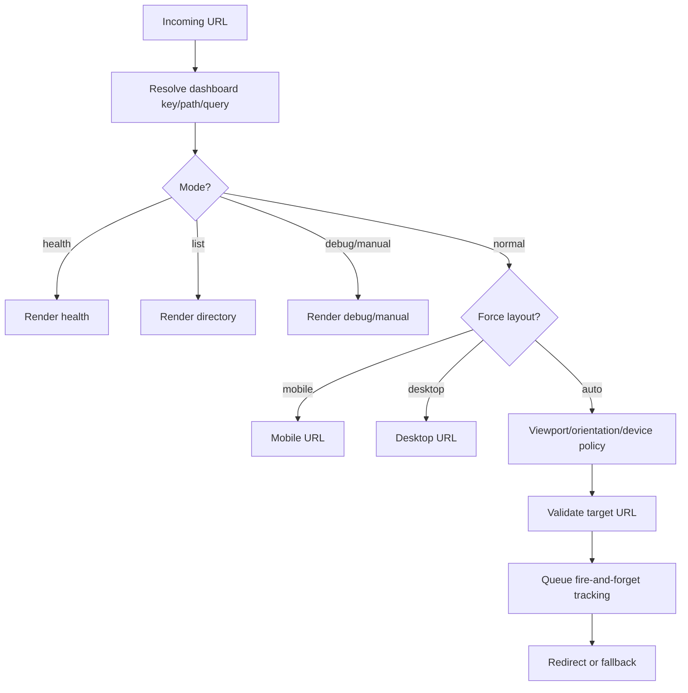

# Routing Guide

## Route model

Root gateway er `/Landspitali/`. Dashboard folder routes eru `/Landspitali/bradamottaka/` og `/Landspitali/thjonustukannanir/`.

Dashboard query override er leyft á root (`allowDashboardQueryOverrideOnRoot = true`) en ekki á dashboard routes (`allowDashboardQueryOverride = false`). Dashboard router pages setja `lockDashboard: true`.

Aliases:

- `bradamottaka`: `bradamottaka`, `bradamottaka-fossvogi`, `brada`, `bráða`.
- `thjonustukannanir`: `thjonustukannanir`, `thjon`, `thjonusta`, `þjónustukannanir`, `þjón`.

## Query parameters

| Param | Hlutverk |
|---|---|
| `dashboard`, `id` | Dashboard lookup á root |
| `force`, `view` | `mobile` eða `desktop` override |
| `debug` | Debug panel, no redirect |
| `health`, `status` | Router health |
| `list`, `dashboards` | Directory/list |
| `noredirect`, `manual` | Manual/no-redirect |
| `utm_*`, `from`, `source` | Source classification |
| `cachebust` | Leyft í tracking payload |
| `diagnostics` | Kveikir diagnostic enrichment |

## Routing decision

## Breakpoint policy

| Gildi | Source value |
|---|---|
| `mobileBreakpoint` | `767` |
| `tabletBreakpoint` | `1024` |
| `phoneMaxWidth` | `767` |
| `compactPhoneMaxWidth` | `480` |
| `tabletPortraitMinWidth` | `768` |
| `tabletPortraitMaxWidth` | `899` |
| `narrowTabletMaxWidth` | `1023` |
| `tabletLandscapeDesktopMinWidth` | `1024` |
| `smallDesktopMinWidth` | `1024` |
| `smallDesktopMaxWidth` | `1279` |
| `desktopMinWidth` | `1280` |
| `validationDesktopWidth` | `1410` |
| `validationMobileWidth` | `360` |

Breakpoint buckets:

| Key | Min | Max | Expected |
|---|---:|---:|---|
| `compact_phone_0_480` | 0 | 480 | mobile |
| `wide_phone_481_767` | 481 | 767 | mobile |
| `tablet_portrait_768_899` | 768 | 899 | mobile |
| `policy_zone_900_1023` | 900 | 1023 | mobile |
| `small_desktop_1024_1279` | 1024 | 1279 | desktop |
| `desktop_1280_plus` | 1280 | 99999 | desktop |

Router core hefur einnig runtime zones `desktop_1280_1409`, `desktop_validation_1410` og `wide_desktop_1421_plus` fyrir telemetry buckets.

## Fallback og validation

Target URL verður að vera `https://app.powerbi.com/view?...`. Ef valin slóð stenst ekki validation notar router safe fallback layout og síðan eina gilda Power BI URL ef þarf. Noscript fallback í router HTML er mobile URL.

Root gateway sýnir þrjú val fyrir hvert dashboard: `Sjálfvirk leiðing`, `Desktop útgáfa` og `Mobile útgáfa`. Desktop/mobile val fer samt í gegnum dashboard router með `force=desktop` eða `force=mobile`, svo validation, fallback og tracking halda áfram á sama stað.

Internet Explorer/Trident fær `microsoft-edge:` redirect ef `isIeMode()` virkjar og target er HTTPS.

## Manual test matrix

Prófa fyrir hvert dashboard: normal, `?debug=1`, `?manual=1`, `?health=1`, `?list=1`, `?force=mobile`, `?force=desktop`, þröngan desktop undir 1024px, tablet portrait, tablet landscape, iPhone Safari, Android Chrome, Samsung Internet og fallback/noscript review.
