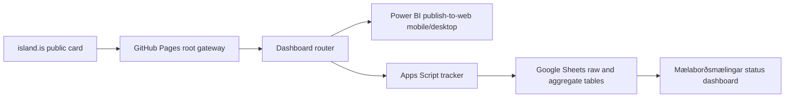
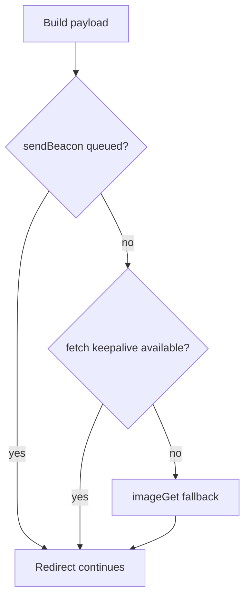

# Technical Guide

## Architecture

## Components

Root gateway er `index.html`. Hann renderar dashboard cards úr `window.LSP_ROUTER_CONFIG` eða fallback lista, býr til þrjú route URL fyrir hvert dashboard (`Sjálfvirk leiðing`, `Desktop útgáfa`, `Mobile útgáfa`) með `utm_source=root_index`, `utm_medium=gateway_card`, `utm_term=auto|desktop|mobile`, og sendir root events (`root_index_view`, `root_dashboard_click`) með `count_as_visit: false`. Desktop/mobile val notar enn dashboard routerinn með `force=desktop` eða `force=mobile`.

Dashboard routers eru `bradamottaka/index.html` og `thjonustukannanir/index.html`. Þær hlaða `assets/router-config.prod.js` og `assets/router-core.prod.js`, setja `window.LSP_ROUTER_BOOTSTRAP.dashboardKey` og `lockDashboard: true`.

Central config er `assets/router-config.json`. Generated config JS eru `assets/router-config.prod.js`, `assets/router-config.next.js` og `assets/router-config.v1.0.0.js`; þær segja `Generated from router-config.json. Do not hand-edit.` Generator/sync ferlið er `tools/generate-router-assets.ps1`.

Router core er `assets/router-core.prod.js`. Þar eru `CORE_VERSION`, route resolution, layout decision, debug/health/list rendering, event payload, diagnostic enrichment og transport order.

Apps Script tracker er `tracker/powerbi_router_tracker_apps_script_v1.0.0.js`. Þar eru `doPost`, `doGet`, `setupProductionWorkbook`, `aggregateRecent`, `publishDashboardData_`, `getHealth_`, `getPublicRegistry_`, `outputData_`, `sanitizeCallback_`, warning logic og sheet schemas.

Status dashboard er `status-dashboard/index.html`. Það hleður JSONP frá Apps Script `api=dashboard&format=js&callback=...`, notar 22 sekúndna timeout með einni sjálfvirkri endurtilraun og renderar panels með `safeRender`.

## Data flow

1. Router velur dashboard út frá path, locked bootstrap eða root query override.
2. Router ákveður layout með forced override, bot policy, viewport/orientation og dashboard route policy.
3. Router validates target URL með Power BI publish-to-web check.
4. Router byggir event payload og sendir fire-and-forget.
5. Apps Script normalizes raw event, dedupe-ar event ID með CacheService og skrifar `Events_Raw`.
6. `aggregateRecent` les síðustu `AGGREGATION_DAYS = 400`, býr til aggregate sheets og keyrir warning logic.
7. `publishDashboardData_` skrifar chunked JSON í `Dashboard_Data`, setur control keys og cache-ar payload í `DASHBOARD_CACHE_SECONDS = 300`.
8. Status dashboard hleður aðeins samantektargögn JSONP og birtir rekstrarsýn.

## Endpoint/API model

Apps Script `doGet` styður:

- `api=dashboard`: cached dashboard payload úr `Dashboard_Data`/cache; public read path forðast full workbook setup nema fast read mistakist.
- `api=health` eða `api=status`: health object.
- `api=registry`: public registry.
- GET event fallback þegar query inniheldur event fields.

`outputData_` skilar JSON eða JSONP. Callback er hreinsaður með `sanitizeCallback_`; ógilt callback fellur í `LandspitaliRouterStatusData`.

## Routing algorithm

Forced layout (`force`/`view`) vinnur yfir auto. Bot/link preview fer á desktop og er ekki counted visit nema config leyfi bots. Auto routing notar visual/layout viewport width, orientation, UA/touch merki og route policy. Settings diagnostics safna aðeins samantektargögn media merkjum eins og reduced transparency, monochrome/update frequency, overflow, scripting og display-mode, en þau breyta ekki routing. Mobile fallback er safe default ef URL validation bregst.

## Tracking transport

Transport order í source er `sendBeacon`, `fetchKeepalive`, `imageGet`. Routing bíður ekki eftir tracker. First-production notes í config segja að POST transports séu á undan `imageGet` svo iPhone Safari sé ekki háður löngum cross-origin tracking pixel fyrir redirect.

## Warning pipeline

Apps Script flokkar raw rows í counted visits, diagnostic/debug, bots og errors. `addOperationalQualityWarnings_` bætir aggregate warnings eins og `no_recent_events`, `no_recent_counted_visits`, `high_fallback_click_rate`, `router_errors_seen`, `safe_fallback_used` og `high_weak_confidence_share`. Power BI viewer compatibility er flokkað með browser/version/tæki; Smart TV/WebView er diagnostic/info nema source staðfesti production impact.

## Rekstrarstig

Status dashboard `opsModel` reiknar score 0-100 úr confirmed warnings, fallback/error count, weak/unknown signal share og freshness penalty. Sjá [score-and-confidence-guide.md](score-and-confidence-guide.md).

## Privacy og retention

Tracker header segir: no cookies, no localStorage identifiers, no raw IP addresses, no names, no emails. Raw rows eru internal. Public/status endpoint er aðeins samantektargögn. `RETENTION_DAYS = 180`, `AGGREGATION_DAYS = 400`.

## Failure modes

- Missing central config: routers nota embedded bootstrap/fallback.
- Invalid Power BI URL: safe fallback layout/URL.
- Apps Script endpoint unavailable: routing heldur áfram, telemetry getur vantað.
- Cache stale: status payload getur sýnt eldri gögn í allt að 300 sekúndur eða þar til publish/aggregation refresh.
- Status JSONP failure: UI sýnir endpoint error eftir 22 sekúndna bið og eina sjálfvirka endurtilraun.
- Source mismatch: config/status/tracker version values geta verið ósamstillt; skjalfest í [known-issues-and-limits.md](known-issues-and-limits.md).
