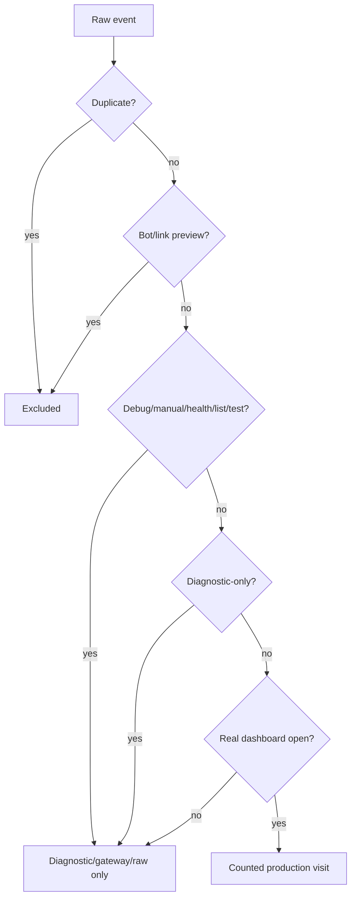

# Tracking and Privacy

## Talningarhlið

## Hvað er tracked

Tracked eru operational telemetry fields: dashboard key/id, selected layout, route reason, viewport, browser/device/display/input/performance signals, source/UTM/referrer domain, tracking method, warning/fallback/error signals og per-event/request identifiers.

## Hvað er ekki tracked

Source header segir: no cookies, no persistent localStorage identifiers, no raw IP addresses, no names, no emails. Ekki er notuð geolocation, canvas/WebGL/audio fingerprinting eða persistent identity.

Event ID er per event. Request ID er per router page load. Þau eru ekki persistent identity.

## Counted visits

`count_as_visit = TRUE` er aðeins fyrir real dashboard open events sem standast server-side gate. `count_as_visit = FALSE` er raw/diagnostic/gateway signal og má ekki lesa sem usage.

Bots og link previews eru excluded. Root gateway views og clicks eru funnel signals, ekki dashboard visits.

## Retention, aggregation og cache

| Gildi | Source |
|---|---|
| `RETENTION_DAYS` | `180` |
| `AGGREGATION_DAYS` | `400` |
| `DASHBOARD_CACHE_SECONDS` | `300` |
| `DASHBOARD_DATA_CELL_CHAR_BUDGET` | `45000` |
| `CONTROL_CELL_CHAR_BUDGET` | `45000` |
| `DASHBOARD_DATA_STORAGE_FORMAT` | `chunked_json_v1` |
| `diagnosticEnrichmentMaxBytes` | `18000` |
| `maxImageGetUrlLength` | `4500` |

`imageGet` hefur URL length risk; router prunar removable fields og flaggar `imageget_payload_near_limit`. Chunking er til að geyma status JSON í mörgum `Dashboard_Data` cellum innan repository-defined budget.

## Scale limits

Apps Script og Sheets eru platform services með kvótum og tímamörkum. Þjónustan notar cache, aggregate sheets og chunked JSON til að minnka load. Nákvæm production capacity þarf að meta út frá raunverulegri umferð, Apps Script quotas og Sheets API/service limits.
